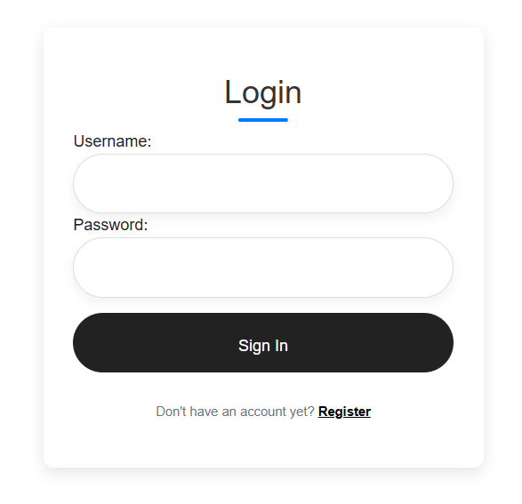
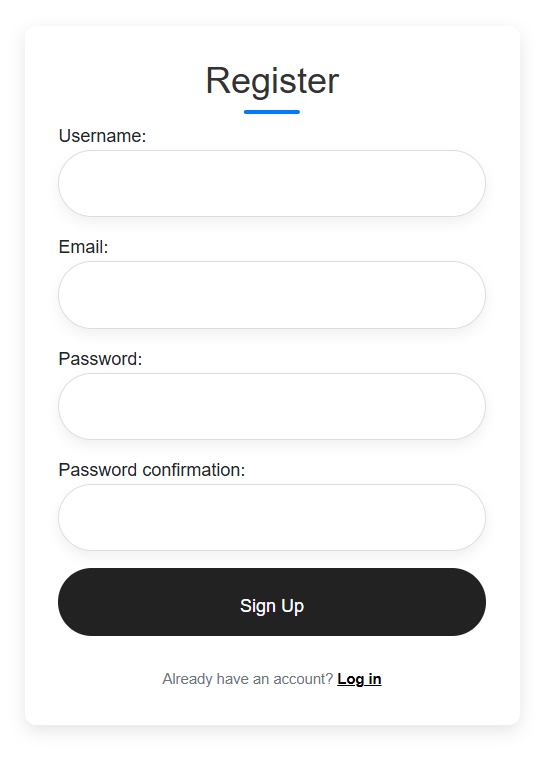
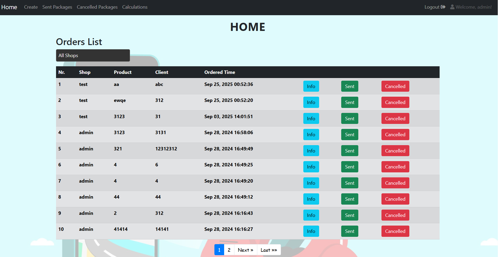
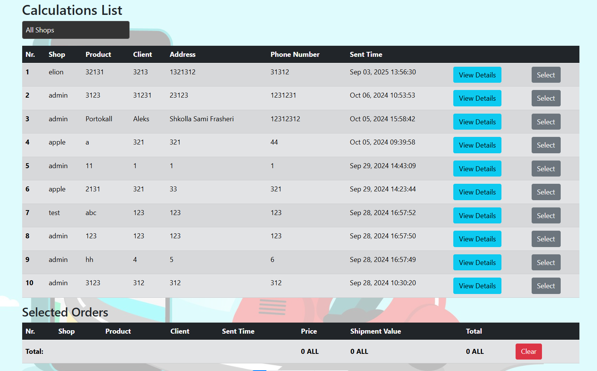

# Post Office Delivery Management System

A Django-based web application to manage package deliveries efficiently.  
Designed for simplicity and clear role management:

- **Admin**: The only admin, responsible for tracking packages, marking them as sent or cancelled, and calculating totals for sent orders.
- **Users**: Can register and place delivery requests.

---

## Features

- Role-based access: Admin vs Users
- User registration and login
- View, cancel, or mark deliveries as sent
- Calculate totals for completed deliveries
- Clean and intuitive interface

---

## Screenshots

<table>
<tr>
<td align="center">

**Login**  

</td>
<td align="center">

**Register**  

</td>
</tr>
</table>

 

<table>
<tr>
<td align="center">

**Home**  

</td>
</tr>
</table>

 

<table>
<tr>
<td align="center">

**Calculations**  

</td>
</tr>
</table>

---

## Installation & Setup

Follow these steps to run the project locally:

### 1. Clone the repository

git clone https://github.com/alekskorri/postoffice-system.git
cd postoffice-system

### 2. Create and activate a virtual environment
    
python -m venv env
# Activate on Windows
env\Scripts\activate
# Activate on Mac/Linux
source env/bin/activate

### 3. Install dependencies

pip install -r requirements.txt

### 4. Apply migrations

python manage.py migrate

### 5. Run the server

python manage.py runserver

### Technologies Used

Python 3

Django

SQLite 

HTML5 / CSS3 / BOOTSTRAP

### Future Improvements

Email or in-app notifications

PDF/CSV delivery reports

Multiple admin support

Advanced package tracking
